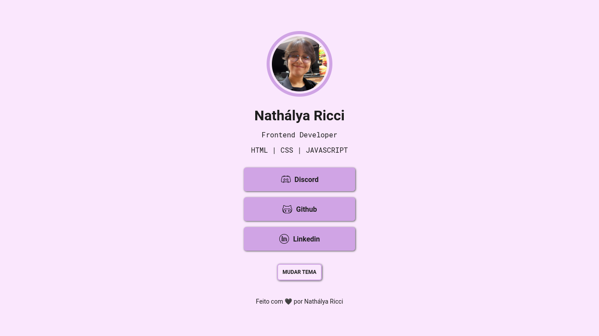
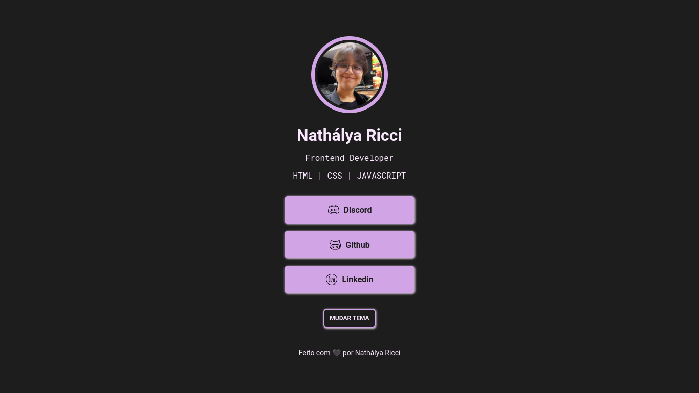

# Rocketlinks

## 💻 Projeto

Desafio proposto na Maratona Explorer da Rocketseat.

Site para concentrar múltiplos links, com versões em modo claro e escuro implementados por mim.
Esta versão é feita com React JS.

## 🛠️ Tecnologias usadas

- React JS
- CSS

## 👀 Live Preview
